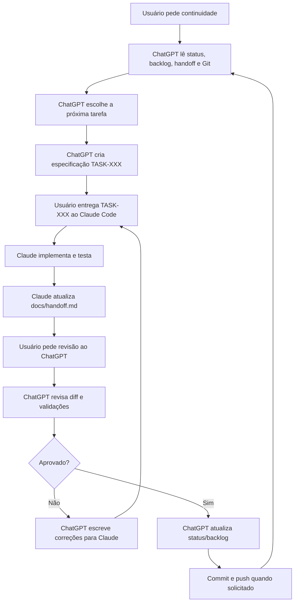

# Workflow ChatGPT + Claude Code

Este documento define como ChatGPT/Codex e Claude Code colaboram neste projeto.
O repositório é a fonte de verdade; a conversa não é memória persistente.

## Pesquisa e Referências

Fontes usadas para definir o fluxo:

- OpenAI/Codex: `AGENTS.md` é carregado como instrução persistente do projeto.
- Anthropic Claude Code: `CLAUDE.md` é o arquivo de memória/instrução do projeto.
- Anthropic Claude Code: boas práticas recomendam explorar, planejar, implementar
  e gerenciar contexto agressivamente.
- GitHub Copilot coding agent: tarefas funcionam melhor quando são pequenas,
  bem descritas, com arquivos prováveis e critérios de aceite.
- MCP: útil para conectar agentes a sistemas externos, mas não é necessário
  como primeira camada para este projeto.
- Claude hooks: úteis para automação futura, mas começam como nível 2.

## Arquitetura Escolhida

Modelo atual recomendado: **Nível 2 — Semi-automatizado local**, mantendo
revisão e validações como travas antes de Git push.

Motivos:

- o projeto é individual;
- o repositório já é pequeno o suficiente para Markdown funcionar bem;
- GitHub Issues/Projects e MCP podem entrar depois, se o volume crescer;
- evita dois agentes alterando código ao mesmo tempo;
- deixa cada decisão auditável no Git.

## Papéis

### ChatGPT / Codex

- diagnostica;
- prioriza;
- escreve tarefas;
- revisa diffs;
- valida segurança, SEO, performance, acessibilidade e arquitetura;
- mantém docs vivos;
- organiza Git/GitHub.

### Claude Code

- implementa tarefas;
- executa comandos;
- cria ou ajusta testes quando solicitado;
- registra relatório em `docs/handoff.md`;
- não decide mudanças arquiteturais grandes sozinho.

## Fonte Única de Verdade

| Informação | Arquivo |
| --- | --- |
| Regras gerais | `AGENTS.md` |
| Regras do Claude | `CLAUDE.md` |
| Estado atual | `docs/project-status.md` |
| Tarefas priorizadas | `docs/backlog.md` |
| Handoff ativo | `docs/handoff.md` |
| Decisões técnicas | `docs/decisions.md` |
| Especificações | `docs/tasks/TASK-XXX-*.md` |
| Arquitetura do app | `docs/architecture.md` |
| Roadmap de produto | `docs/roadmap.md` |

## Ciclo Operacional

## Formato de Tarefa

Cada tarefa para Claude deve conter:

- ID;
- objetivo;
- contexto;
- arquivos provavelmente envolvidos;
- requisitos;
- restrições;
- critérios de aceite;
- testes necessários;
- validação esperada pelo ChatGPT.

## Handoff

Claude registra o resultado no topo de `docs/handoff.md`. ChatGPT lê esse arquivo
antes de revisar qualquer diff.

## Controle de Concorrência

- Um agente implementador por tarefa.
- Sem alterações paralelas nos mesmos arquivos.
- Antes de qualquer trabalho: `git status -sb`.
- Se houver mudanças inesperadas: parar e registrar bloqueio.
- Preferir commits pequenos por tarefa aprovada.

## Níveis de Automação

### Nível 1 — Manual e Simples

- Markdown no repositório.
- Tarefas em `docs/tasks/`.
- Handoff em `docs/handoff.md`.
- Commits manuais após revisão.

Recomendado agora.

### Nível 2 — Semi-Automatizado

**Fluxo primário (confirmado em uso real, TASK-004 a TASK-015):** Claude
Code rodando interativamente, chamando o plugin `codex@openai-codex`
(`/codex:review --background`) por tarefa, seguindo
`docs/claude-codex-continuous-loop.md`. GitHub Actions (TASK-011) cobre
lint/test/build/audit em push/PR. Este é o fluxo recomendado para
trabalhos futuros — veja "Limites Conhecidos do Plugin Codex" abaixo
antes de rodar um loop longo sem supervisão.

**Fluxo legado/alternativo:** `scripts/agent-loop.ps1` (documentado em
`docs/automation.md`) orquestra Claude Code e o Codex CLI como
subprocessos via PowerShell, com logs em `.agent-loop/`. Não foi usado
nesta sessão nem em nenhuma das TASK-001 a TASK-015; mantido no
repositório como histórico e como alternativa para rodar o loop fora de
uma sessão interativa do Claude Code (ex.: agendado, headless), mas não é
mais o caminho recomendado por padrão.

Decisão final (TASK-015): **não adotar** GitHub Issues por tarefa nem
branch/PR por tarefa por enquanto. Motivo: o projeto é individual (sem
colaboradores revisando PRs), o fluxo atual de arquivo
(`docs/tasks/` + `docs/backlog.md` + `docs/handoff.md`) já funcionou bem
em 15 tarefas reais, e cada tarefa já passa por uma revisão objetiva
(Codex ou Claude Code, ver abaixo) antes do commit — branch/PR
adicionaria cerimônia sem um revisor humano adicional para justificar o
ganho. Reavaliar se o projeto ganhar colaboradores ou se o usuário quiser
um gate manual extra antes de mergear.

## Limites Conhecidos do Plugin Codex

Observados nesta sessão (TASK-010 em diante), registrados aqui para que
sessões futuras não percam tempo redescobrindo:

- **Quota de uso da conta ChatGPT/Codex pode se esgotar no meio do
  loop.** `/codex:review`/`/codex:adversarial-review` falham com uma
  mensagem explícita (`Codex error: You've hit your usage limit... or try
  again at HH:MM`), não relacionada ao diff sendo revisado. Não adianta
  tentar de novo imediatamente.
- **O "stop-time review gate"** (`/codex:setup --enable-review-gate`)
  passa a exigir uma revisão Codex bem-sucedida antes de qualquer resposta
  poder terminar — se a quota estiver esgotada, isso bloqueia **todas** as
  respostas seguintes, não só as relacionadas a revisão de código. Para
  destravar: `/codex:setup --disable-review-gate` (pode ser reativado
  depois com `--enable-review-gate`).
- **Fallback quando o Codex está indisponível**: a pedido explícito do
  usuário, Claude Code pode assumir o papel de revisor objetivo (reler o
  diff criticamente, como uma revisão externa faria) em vez de pausar o
  loop inteiro. Isso deve ficar **marcado explicitamente** no bloco de
  `docs/handoff.md` daquela tarefa ("revisado por Claude, Codex
  indisponível"), nunca apresentado como se o Codex tivesse revisado —
  para que ChatGPT/Codex possa fazer uma segunda revisão retroativa
  quando a quota voltar.
- Trocar de conta ChatGPT (ex.: para uma conta Pro com mais quota) exige
  rodar `codex login` interativamente (fluxo de navegador) — um agente não
  pode fazer isso sozinho; é preciso pedir ao usuário para rodar
  `!codex login` no prompt do Claude Code.

### Nível 3 — Altamente Automatizado

- MCP com GitHub/Supabase/Vercel.
- Agentes com permissões separadas.
- PRs automáticos por tarefa.
- Checks obrigatórios antes de merge.

Não recomendado neste momento: adiciona complexidade e risco operacional.
