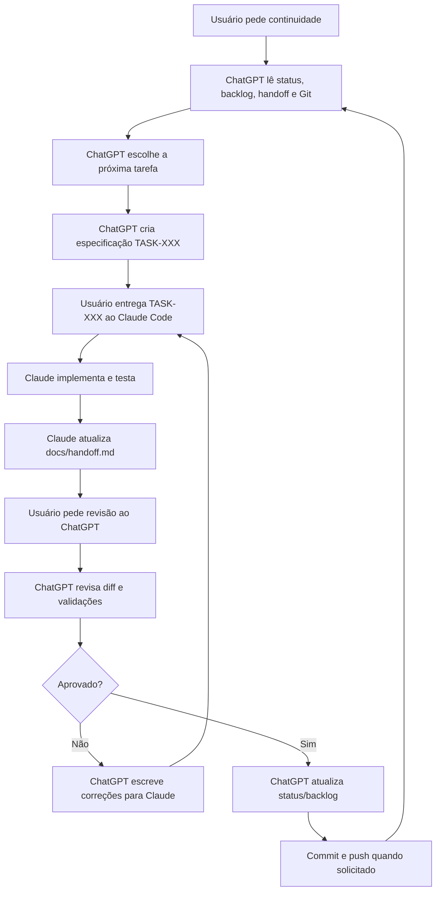

# Workflow ChatGPT + Claude Code

Este documento define como ChatGPT/Codex e Claude Code colaboram neste projeto.
O repositório é a fonte de verdade; a conversa não é memória persistente.

## Pesquisa e Referências

Fontes usadas para definir o fluxo:

- OpenAI/Codex: `AGENTS.md` é carregado como instrução persistente do projeto.
- Anthropic Claude Code: `CLAUDE.md` é o arquivo de memória/instrução do projeto.
- Anthropic Claude Code: boas práticas recomendam explorar, planejar, implementar
  e gerenciar contexto agressivamente.
- GitHub Copilot coding agent: tarefas funcionam melhor quando são pequenas,
  bem descritas, com arquivos prováveis e critérios de aceite.
- MCP: útil para conectar agentes a sistemas externos, mas não é necessário
  como primeira camada para este projeto.
- Claude hooks: úteis para automação futura, mas começam como nível 2.

## Arquitetura Escolhida

Modelo atual recomendado: **Nível 2 — Semi-automatizado local**, mantendo
revisão e validações como travas antes de Git push.

Motivos:

- o projeto é individual;
- o repositório já é pequeno o suficiente para Markdown funcionar bem;
- GitHub Issues/Projects e MCP podem entrar depois, se o volume crescer;
- evita dois agentes alterando código ao mesmo tempo;
- deixa cada decisão auditável no Git.

## Papéis

### ChatGPT / Codex

- diagnostica;
- prioriza;
- escreve tarefas;
- revisa diffs;
- valida segurança, SEO, performance, acessibilidade e arquitetura;
- mantém docs vivos;
- organiza Git/GitHub.

### Claude Code

- implementa tarefas;
- executa comandos;
- cria ou ajusta testes quando solicitado;
- registra relatório em `docs/handoff.md`;
- não decide mudanças arquiteturais grandes sozinho.

## Fonte Única de Verdade

| Informação | Arquivo |
| --- | --- |
| Regras gerais | `AGENTS.md` |
| Regras do Claude | `CLAUDE.md` |
| Estado atual | `docs/project-status.md` |
| Tarefas priorizadas | `docs/backlog.md` |
| Handoff ativo | `docs/handoff.md` |
| Decisões técnicas | `docs/decisions.md` |
| Especificações | `docs/tasks/TASK-XXX-*.md` |
| Arquitetura do app | `docs/architecture.md` |
| Roadmap de produto | `docs/roadmap.md` |

## Ciclo Operacional

## Formato de Tarefa

Cada tarefa para Claude deve conter:

- ID;
- objetivo;
- contexto;
- arquivos provavelmente envolvidos;
- requisitos;
- restrições;
- critérios de aceite;
- testes necessários;
- validação esperada pelo ChatGPT.

## Handoff

Claude registra o resultado no topo de `docs/handoff.md`. ChatGPT lê esse arquivo
antes de revisar qualquer diff.

## Controle de Concorrência

- Um agente implementador por tarefa.
- Sem alterações paralelas nos mesmos arquivos.
- Antes de qualquer trabalho: `git status -sb`.
- Se houver mudanças inesperadas: parar e registrar bloqueio.
- Preferir commits pequenos por tarefa aprovada.

## Níveis de Automação

### Nível 1 — Manual e Simples

- Markdown no repositório.
- Tarefas em `docs/tasks/`.
- Handoff em `docs/handoff.md`.
- Commits manuais após revisão.

Recomendado agora.

### Nível 2 — Semi-Automatizado

- Script local `scripts/agent-loop.ps1`.
- Claude Code implementa a próxima tarefa do backlog.
- Codex CLI revisa em modo somente leitura.
- Logs e estado ficam em `.agent-loop/`.
- GitHub Issues para cada `TASK-XXX`.
- Branch por tarefa.
- PR para revisão.
- Hooks do Claude para avisar conclusão ou rodar lint/build.
- GitHub Actions para lint/build/audit.

Recomendado agora em modo local. GitHub Issues, branches por tarefa e PRs ainda
podem entrar depois.

### Nível 3 — Altamente Automatizado

- MCP com GitHub/Supabase/Vercel.
- Agentes com permissões separadas.
- PRs automáticos por tarefa.
- Checks obrigatórios antes de merge.

Não recomendado neste momento: adiciona complexidade e risco operacional.
